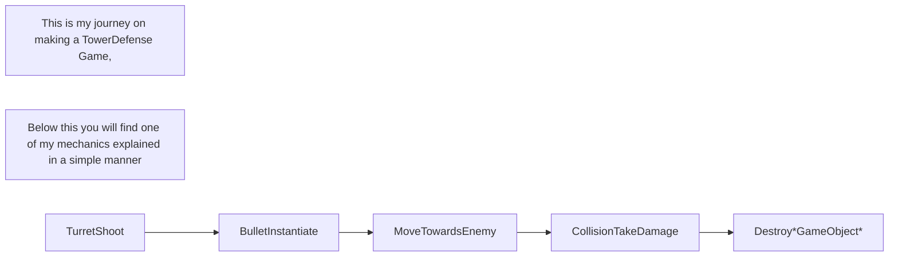

# Wat ik heb geleerd bij TD.
## Het moeilijkst vond ik: RayCast en Insantiate.
## Het makkelijkst: WaveSpawning en Waypoints.
### Instantiate is wanneer je een gameobject inspawnt op een point. De bullet die checked zijn code en MoveTowards naar de enemie die de turret heeft gemarkt en als er collision is dan destroyen beide gameobjects.
### De Raycast die ik heb gemaakt laat mij de turrets neer zetten op nodes als er genoeg munten zijn. Dat heb ik gedaan door { if(currency <= 5)} te gebruiken zodra je genoeg heb kan je de turret purchasen in de shop, wanneer de turret gepurchased is kan je hem neerzetten op een van de nodes en dan wordt de node een parent van de turret.
### WaveSpawning maakte ik ook gebruik van instantiate, iedere seconden spawnde x amount of enemies. Als alle enemies gedestroyed zijn, dan doet hij een count dan van de volgende wave en dan begint hij weer een instantiate.
### Waypoints vond ik persoonlijk het makkelijkst, Ik had in de map 8 punten neergezet en die in code aangegeven waardoor de gespawnde enemies er rechtstreeks heen konden uit hun spawn.