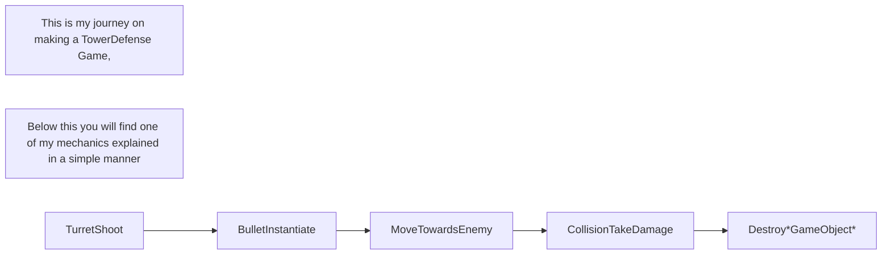

```mermaid
  flowchart LR
    id[This is my journey on making a TowerDefense Game,]
    id2[Below this you will find one of my mechanics explained in a simple manner]
    TurretShoot-->BulletInstantiate;
    BulletInstantiate-->MoveTowardsEnemy;
    MoveTowardsEnemy-->CollisionTakeDamage;
    CollisionTakeDamage-->Destroy*GameObject*;
```